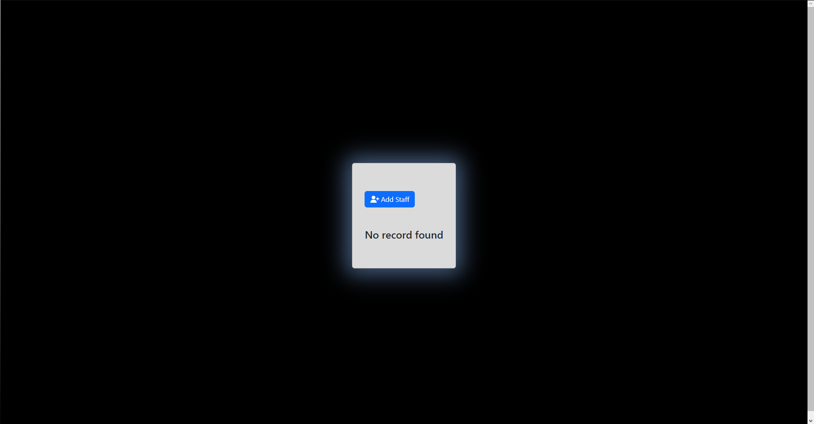
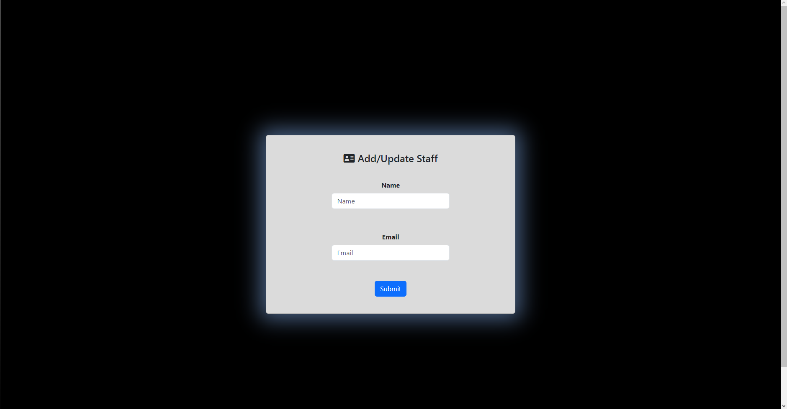
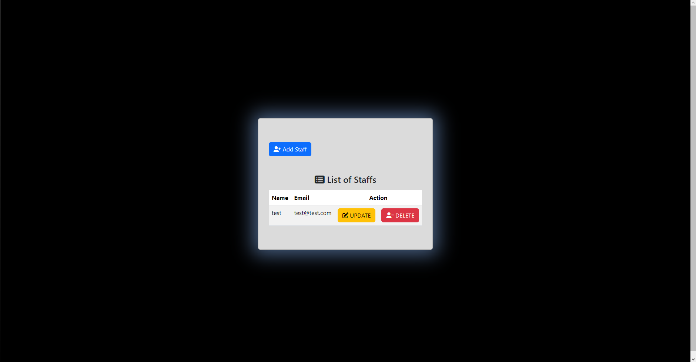
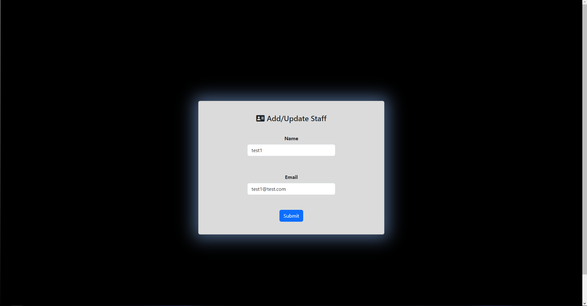
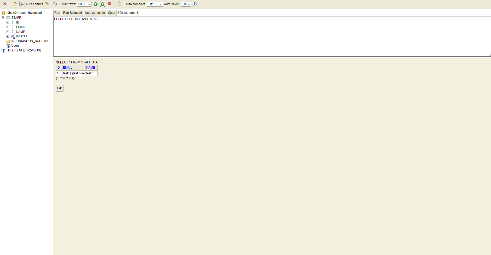

<h3 align="center">Practical Exercise</h3>

## About The Project
CRUD Operations in Spring Boot with the usage of Thymeleaf

## Tools and technologies used
• Java 17 • Maven • Spring Boot 3 • Spring Web • Spring Data JPA • Lombok • H2 Database • Thymeleaf • Fontawesome • Bootstrap •

## Preview
- Page that will contain a list of staff (if there are none, it will show "No records found")
  

- Page to add a new staff
  
  

- After successfully adding a staff, it will be shown in the list, and the user will be able to update or delete that staff
  

- If we try to update a selected staff using the "Update" button from the staff list, it will redirect us to the same add page, but the inputs will retain the data, and the user can make changes
  

- After updating the necessary data and clicking "Submit" it will redirect us to the list, and we can see that the data has been updated
  
  
- We also have the option to delete a staff from the list using the "Delete" button
  
- And finally we can verify our data in our H2 database
  

